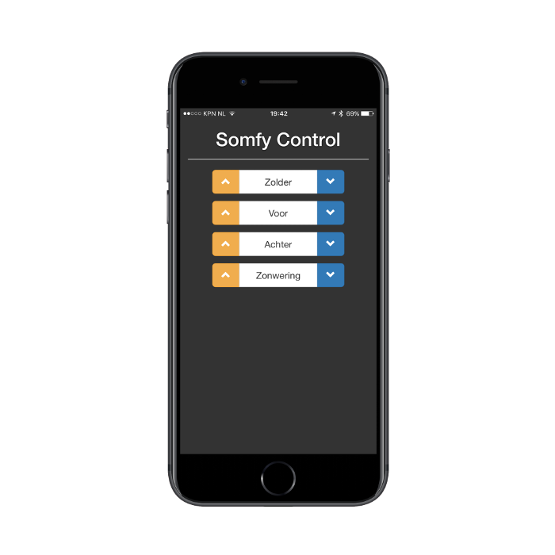

# Somfy Webcontrol with Django on GCP

This project is a work-in-progress to automate the blinds in my home using an app to publish to an
online message bus. This repository covers the building of the first step: a webpage to publish
actionable events on that message bus. To do this we'll:

  1. Use Google Cloud Platform to run our application.
      1. Google CloudSQL for the database functions
      2. Google App Engine for Python app hosting
      3. Google Cloud Storage to host our static content (images, CSS, etc.)
  2. Build a (minimal) Django app *with authentication*.
  3. Use a [CloudMQTT](https://www.cloudmqtt.com/) message bus to publish events to.

This is mostly just a learning process for me, but hopefully these notes can be of use to someone
else as well.

In the end we'll end up with a decent looking Bootstrap page for use on any device:



 > **Important:** This application and its tooling uses settings that it expects in
 > `app_settings.yaml`. A template for this file is provided, please complete it with the values as
 > you go through the steps below.

## Google Cloud Platform

Interacting with GCP is easiest through the `gcloud` CLI/SDK tool. Follow the [instructions to
install the `gcloud` SDK](https://cloud.google.com/sdk/downloads). The unfortunate thing about the
SDK is that it requires Python 2.7, while I like to use 3.5+ exclusively. Luckily you can install
the SDK in a folder with a Python [`pyenv virtualenv`](https://github.com/pyenv/pyenv-virtualenv).
How to setup such an environment is outside the scope of this document.

What's important to know, is that using that virtual environment, you can force the `gcloud` tool 
to use that Python version by setting the `CLOUDSDK_PYTHON` environment variable. If you then also
add the path of the folder where you unpacked the SDK to your `$PATH`, you're good to go! For 
example, I use the following file that I `source` every time I need to use the SDK:

```
export CLOUDSDK_PYTHON=$HOME/.pyenv/versions/gcloud-2.7.12/bin/python2
export CLOUDSDK_PYTHON_SITEPACKAGES=1
export PATH="$PATH:$HOME/sources/gcloud/google-cloud-sdk/bin"
```

To start the project we'll first define some of the values. Make sure you run the other commands
referencing these from the same shell session, or set them again in another session.

```
PROJECT=somfy-iot
REGION=europe-west
DATABASE=django-db
```

Create your GCP project and switch to it. Finally, get the credentials to make use of the full GCP
suite through the CLI tool using [Application Default Credentials](https://developers.google.com/identity/protocols/application-default-credentials)

```
gcloud projects create $PROJECT --name="Somfy Control IOT Project"
gcloud config set project $PROJECT
gcloud auth application-default login
```

### Google CloudSQL

Django needs a database to function properly and we'll use the CloudSQL database in GCP. Note we're
using the smallest instance available, which should be enough for this environment. Scale up when 
needed.

```
gcloud sql instances create $DATABASE --tier=db-f1-micro --region=${REGION}1 --activation-policy=ALWAYS
gcloud sql instances set-root-password $DATABASE --password xxxxxxxx
gcloud sql instances describe | grep connectionName
```

Use the output of the last command as the value for `cloudsql_connection` in `app_settings.yaml`.
You can then run `make sql` to start the local CloudSQL proxy. Open another terminal window (`source`
your `gcloud` settings, if needed) and do so now.

This will allow you to create the SQL database using the root password you set earlier. Open 
another terminal window for this to run the `mysql` command as described below. Install through 
`brew install mysql` if needed.

```
mysql --host 127.0.0.1 --user root --password
..
mysql> CREATE DATABASE django-db
mysql> CREATE USER 'django_admin' IDENTIFIED BY 'xxxxxxxx';
mysql> GRANT ALL ON django-db.* TO 'django_admin';
```

Also make sure to add the values you use for database name, username and password to
`app_settings.yaml`.

### Google App Engine

To activate a Google App Engine app, just create one associated to your project. Note that the 
region cannot be changed at a later time.

 > *I learned the hard way, since the GCP Django on App Engine tutorial did not mention it and I
 > had to destroy and create a new project. Also, after destroying project you cannot use that name
 > for another project for a couple of days...*

```
gcloud app create --region $REGION
```

The configuration for the application enviroment is all defined in `app.yaml`. Note that there is
still a static setting here: `cloud_sql_instances`. Change this to the `cloudsql_connection` value
you set earlier in `app_settings.yaml`. I haven't found a way to extract that value automatically
yet.

The `app.yaml` file further specifies that we're not using automatic scaling and always want just
a single instance. We're also not interested in health checks or high specs for our application. 
Further details on configuring this file, pleas see [the app.yaml reference][app-yaml].

Gunicorn (the server actually hosting the Django app on App Engine) does not serve static contect,
so we need to upload our static folder to a bucket in Google Cloud Storage. Let's first only create
it:

```
gsutil mb gs://$PROJECT
gsutil defacl set public-read gs://$PROJECT
```

## Django Web Application

To run your Django app locally for development but also be able to deploy easily, I have defined
a simple `if..else` statement in Django's `settings.py` file to see where the application is running.
If it's in an App Engine environment it will connect to the SQL socket for a database connection,
or else it will try to connect to the local database host (your SQL proxy towards the CloudSQL
instance).

The settings also specify not to show debug output in production and that static content is served
either from a local directory or the Cloud Storage bucket.

```python
if os.getenv('GAE_INSTANCE'):
    DEBUG = False
    DATABASES['default']['HOST'] = '/cloudsql/' + SETTINGS['cloudsql_connection']
    ALLOWED_HOSTS = ['.appspot.com']
    STATIC_URL = 'https://storage.googleapis.com/' + SETTINGS['bucket'] + '/static/'
else:
    DEBUG = True
    DATABASES['default']['HOST'] = SETTINGS['db_host_local']
    STATIC_URL = '/static/'
    ALLOWED_HOSTS = ['*']
```

### Database Preparation

Install the MySQL client for Python (in your virtual environment of course) and prepare and execute
the required actions for the database for your Django application. When that is successful, add an
admin account to the installation.

```
pip install mysqlclient
python manage.py makemigrations
python manage.py makemigrations somfy_controller
python manage.py migrate
python manage.py createsuperuser --username=adnin --email=xxx@xxx.xxx
```

### Running a Local Dev Server

Run `make sql` in a different terminal window if you've already closed the previous.

```
python manage.py runserver
```

### Deploying the App

Running `make` will basically run the following commands to upload your static content and build
and deploy your app to App Engine:

```
python manage.py collectstatic --noinput
gsutil -m rsync -x ".*DS_Store" -R static gs://$(BUCKET)/static
gcloud app deploy
```

## Resources

[gcp-django]: https://cloud.google.com/python/django/flexible-environment
[django-auth]: http://blog.narenarya.in/right-way-django-authentication.html
[single-app]: https://zindilis.com/blog/2017/01/06/django-anatomy-for-single-app.html
[app-yaml]: https://cloud.google.com/appengine/docs/flexible/python/configuring-your-app-with-app-yaml
